# SParking UTN — Smart & Integrated Parking System

**SParking UTN** adalah sistem manajemen perparkiran pintar berbasis web futuristik yang dirancang khusus untuk ekosistem kampus **Universitas Teknologi Nusantara (UTN)**. Sistem ini mengintegrasikan pemantauan kapasitas slot parkir secara real-time melalui peta 3D interaktif, registrasi kendaraan mandiri, pembayaran elektronik via e-wallet terintegrasi, serta gerbang check-out berbasis scan QR Code (dengan webcam scanner).

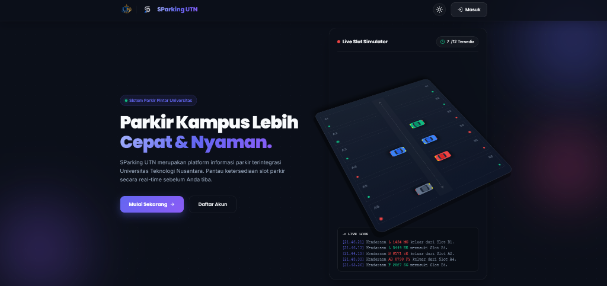

---

## 📋 Daftar Isi
- [📌 Overview & Case Study](#-overview--case-study)
- [⚙️ Arsitektur Sistem](#️-arsitektur-sistem)
- [📂 Database Diagram (ERD) & Process Flow](#-database-diagram-erd--process-flow)
- [👤 Screenshot Peran (Role Showcase)](#-screenshot-peran-role-showcase)
- [🛠️ Spesifikasi Teknologi (Tech Stack)](#️-spesifikasi-teknologi-tech-stack)
- [🚀 Petunjuk Pemasangan (Setup Guide)](#-petunjuk-pemasangan-setup-guide)
- [🔑 Kredensial Akun Uji Coba](#-kredensial-akun-uji-coba)

---

## 📌 Overview & Case Study

### 🔍 Masalah (Problem)
Sistem perparkiran konvensional di lingkungan kampus UTN sebelumnya masih menggunakan pencatatan manual berbasis karcis kertas. Hal ini menimbulkan beberapa kendala utama:
1. **Antrean Panjang**: Proses pencatatan manual saat masuk dan pembayaran tunai saat keluar memakan waktu lama, menyebabkan kemacetan di pintu gerbang kampus pada jam masuk/pulang.
2. **Ketiadaan Informasi Slot**: Pengendara (mahasiswa/dosen/staf) tidak mengetahui ketersediaan slot parkir yang kosong sebelum masuk, sehingga membuang waktu berkeliling mencari tempat kosong.
3. **Risiko Kebocoran Dana**: Karcis kertas mudah hilang dan pencatatan manual rawan manipulasi laporan pendapatan pendapatan harian/bulanan.

### 💡 Solusi (Solution)
**SParking UTN** hadir sebagai solusi sistem perparkiran pintar berbasis web terintegrasi yang menghadirkan efisiensi, transparansi, dan kemudahan akses:
- **Peta Slot Parkir 3D Real-time**: Simulator slot parkir interaktif pada Landing Page yang menampilkan status terisi/kosong di berbagai fakultas secara instan.
- **Registrasi & Booking QR**: Pengguna dapat mendaftarkan kendaraan mereka secara mandiri, menghubungkan e-wallet, dan memesan tempat parkir untuk menghasilkan QR Code check-in & check-out secara otomatis.
- **Otomatisasi Pintu Keluar**: Petugas gerbang hanya perlu memindai QR Code dari layar HP pengguna menggunakan kamera/webcam laptop untuk memproses check-out instan.
- **Pembayaran Cashless**: Integrasi simulasi saldo E-Wallet (GoPay, OVO, DANA, ShopeePay, LinkAja) untuk pemotongan saldo otomatis yang aman dan praktis.

### 📈 Hasil (Result)
- **Efisiensi Gerbang**: Waktu transaksi check-out gerbang tereduksi hingga **70%** menggunakan scanner QR webcam.
- **Transparansi Keuangan**: Audit keuangan perparkiran menjadi **100% digital** dengan laporan pendapatan real-time yang dapat diekspor langsung ke file PDF.
- **Kenyamanan Pengguna**: Mengurangi waktu mencari parkir di kampus secara signifikan karena kapasitas slot terpantau sebelum tiba di lokasi.

---

## ⚙️ Arsitektur Sistem

Sistem SParking menggunakan arsitektur modular multi-role dengan alur kerja backend terintegrasi:

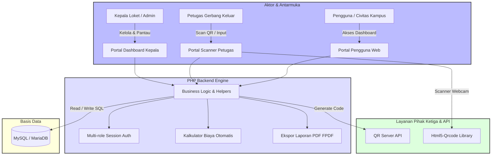
```mermaid
flowchart TD
    subgraph Aktor_Antarmuka [Aktor & Antarmuka]
        U[Pengguna / Civitas Kampus] -->|Akses Dashboard| UI_U[Portal Pengguna Web]
        P[Petugas Gerbang Keluar] -->|Scan QR / Input| UI_P[Portal Scanner Petugas]
        K[Kepala Loket / Admin] -->|Kelola & Pantau| UI_K[Portal Dashboard Kepala]
    end

    subgraph Backend_Engine [PHP Backend Engine]
        UI_U --> Logic[Business Logic & Helpers]
        UI_P --> Logic
        UI_K --> Logic
        
        Logic --> Auth[Multi-role Session Auth]
        Logic --> Calc[Kalkulator Biaya Otomatis]
        Logic --> Report[Ekspor Laporan PDF FPDF]
    end

    subgraph Integrasi_API [Layanan Pihak Ketiga & API]
        Logic -->|Generate Code| QR_API[QR Server API]
        UI_P -->|Scanner Webcam| Cam_JS[Html5-Qrcode Library]
    end

    subgraph Penyimpanan_Data [Basis Data]
        Logic -->|Read / Write SQL| DB[(MySQL / MariaDB)]
    end

    style Aktor_Antarmuka fill:#bbf,stroke:#333,stroke-width:2px
    style Backend_Engine fill:#ddf,stroke:#333,stroke-width:2px
    style Integrasi_API fill:#dfd,stroke:#333,stroke-width:2px
    style Penyimpanan_Data fill:#ffd,stroke:#333,stroke-width:2px
```

### 📋 Use Case Diagram Sistem
Diagram ini memetakan fungsionalitas sistem yang dapat diakses oleh setiap Peran Aktor (Pengguna Parkir, Petugas Gerbang Keluar, Kepala Loket) serta interaksi dengan perangkat luar (CCTV ANPR dan Mesin Loket Masuk):

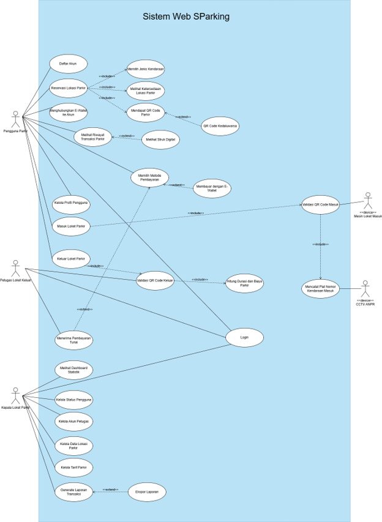

---

## 📂 Database Diagram (ERD) & Process Flow

### 1. Database Class Diagram (Barker ERD)
Skema relasi entitas basis data SParking UTN:

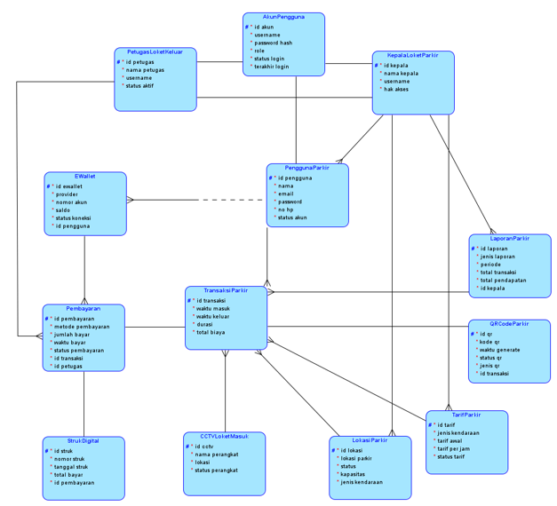

> [!NOTE]  
> Anda juga dapat melihat representasi database secara interaktif melalui diagram Mermaid ERD berikut:

<details>
<summary><b>Klik untuk melihat kode Mermaid ERD</b></summary>

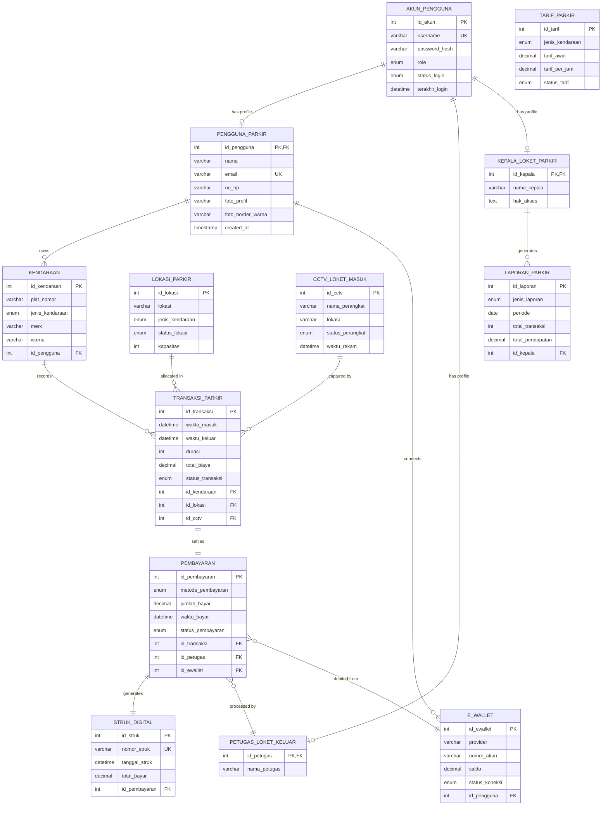
```mermaid
erDiagram
    AKUN_PENGGUNA {
        int id_akun PK
        varchar username UK
        varchar password_hash
        enum role
        enum status_login
        datetime terakhir_login
    }
    PENGGUNA_PARKIR {
        int id_pengguna PK, FK
        varchar nama
        varchar email UK
        varchar no_hp
        varchar foto_profil
        varchar foto_border_warna
        timestamp created_at
    }
    PETUGAS_LOKET_KELUAR {
        int id_petugas PK, FK
        varchar nama_petugas
    }
    KEPALA_LOKET_PARKIR {
        int id_kepala PK, FK
        varchar nama_kepala
        text hak_akses
    }
    KENDARAAN {
        int id_kendaraan PK
        varchar plat_nomor
        enum jenis_kendaraan
        varchar merk
        varchar warna
        int id_pengguna FK
    }
    E_WALLET {
        int id_ewallet PK
        varchar provider
        varchar nomor_akun
        decimal saldo
        enum status_koneksi
        int id_pengguna FK
    }
    LOKASI_PARKIR {
        int id_lokasi PK
        varchar lokasi
        enum jenis_kendaraan
        enum status_lokasi
        int kapasitas
    }
    TARIF_PARKIR {
        int id_tarif PK
        enum jenis_kendaraan
        decimal tarif_awal
        decimal tarif_per_jam
        enum status_tarif
    }
    CCTV_LOKET_MASUK {
        int id_cctv PK
        varchar nama_perangkat
        varchar lokasi
        enum status_perangkat
        datetime waktu_rekam
    }
    TRANSAKSI_PARKIR {
        int id_transaksi PK
        datetime waktu_masuk
        datetime waktu_keluar
        int durasi
        decimal total_biaya
        enum status_transaksi
        int id_kendaraan FK
        int id_lokasi FK
        int id_cctv FK
    }
    PEMBAYARAN {
        int id_pembayaran PK
        enum metode_pembayaran
        decimal jumlah_bayar
        datetime waktu_bayar
        enum status_pembayaran
        int id_transaksi FK
        int id_petugas FK
        int id_ewallet FK
    }
    STRUK_DIGITAL {
        int id_struk PK
        varchar nomor_struk UK
        datetime tanggal_struk
        decimal total_bayar
        int id_pembayaran FK
    }
    LAPORAN_PARKIR {
        int id_laporan PK
        enum jenis_laporan
        date periode
        int total_transaksi
        decimal total_pendapatan
        int id_kepala FK
    }

    AKUN_PENGGUNA ||--o| PENGGUNA_PARKIR : "has profile"
    AKUN_PENGGUNA ||--o| PETUGAS_LOKET_KELUAR : "has profile"
    AKUN_PENGGUNA ||--o| KEPALA_LOKET_PARKIR : "has profile"
    
    PENGGUNA_PARKIR ||--o{ KENDARAAN : "owns"
    PENGGUNA_PARKIR ||--o{ E_WALLET : "connects"
    
    KENDARAAN ||--o{ TRANSAKSI_PARKIR : "records"
    LOKASI_PARKIR ||--o{ TRANSAKSI_PARKIR : "allocated in"
    CCTV_LOKET_MASUK ||--o{ TRANSAKSI_PARKIR : "captured by"
    
    TRANSAKSI_PARKIR ||--|| PEMBAYARAN : "settles"
    PEMBAYARAN ||--|| STRUK_DIGITAL : "generates"
    PEMBAYARAN }o--|| PETUGAS_LOKET_KELUAR : "processed by"
    PEMBAYARAN }o--|| E_WALLET : "debited from"
    
    KEPALA_LOKET_PARKIR ||--o{ LAPORAN_PARKIR : "generates"
```
</details>

### 2. Skema & Struktur Basis Data di phpMyAdmin
Pencatatan data dilakukan di server database MySQL/MariaDB. Berikut adalah daftar 14 tabel dan visualisasi struktur kolom data tabel utama:

<table>
  <tr>
    <td width="50%">
      <b>Daftar 14 Tabel SParking di phpMyAdmin</b><br/>
      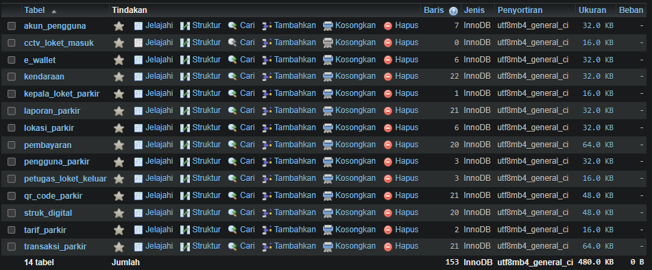
    </td>
    <td width="50%">
      <b>Struktur Tabel `akun_pengguna`</b><br/>
      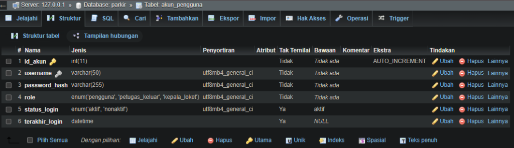
    </td>
  </tr>
  <tr>
    <td width="50%">
      <b>Struktur Tabel `pengguna_parkir`</b><br/>
      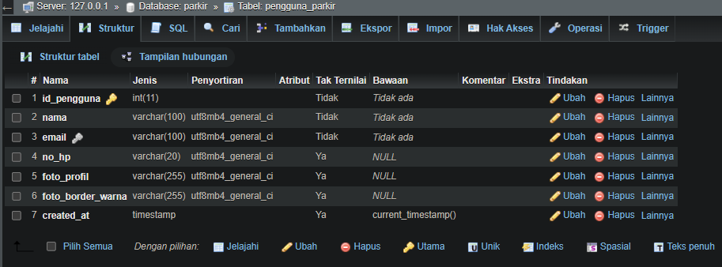
    </td>
    <td width="50%">
      <b>Struktur Tabel `petugas_loket_keluar`</b><br/>
      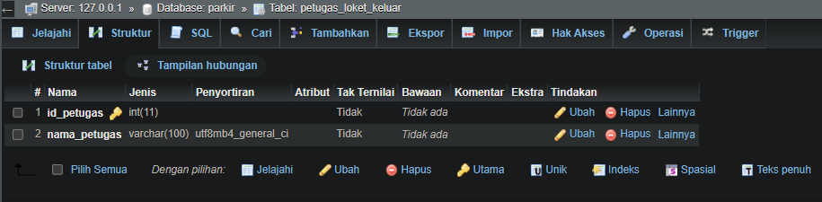
    </td>
  </tr>
  <tr>
    <td width="50%">
      <b>Struktur Tabel `e_wallet`</b><br/>
      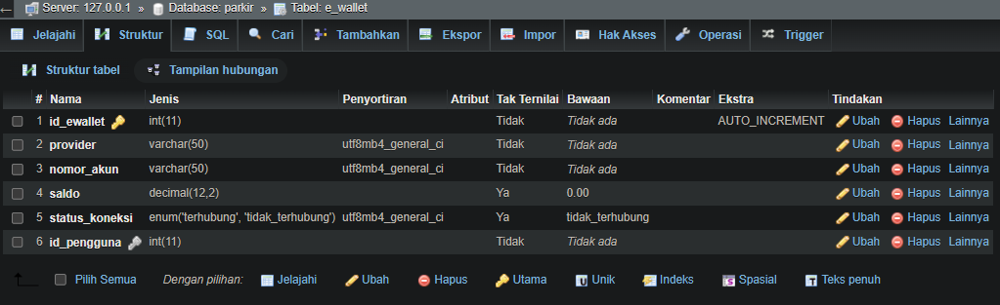
    </td>
    <td width="50%">
      <b>Struktur Tabel `kendaraan`</b><br/>
      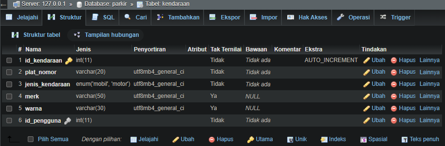
    </td>
  </tr>
  <tr>
    <td width="50%">
      <b>Struktur Tabel `lokasi_parkir`</b><br/>
      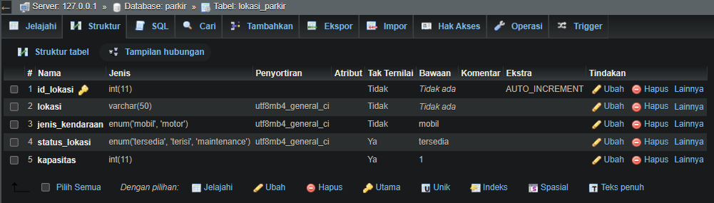
    </td>
    <td width="50%">
      <b>Struktur Tabel `tarif_parkir`</b><br/>
      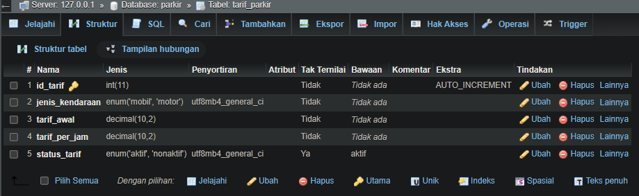
    </td>
  </tr>
  <tr>
    <td width="50%">
      <b>Struktur Tabel `transaksi_parkir`</b><br/>
      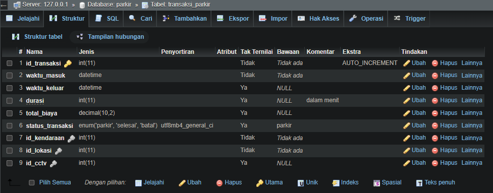
    </td>
    <td width="50%">
      <b>Struktur Tabel `pembayaran`</b><br/>
      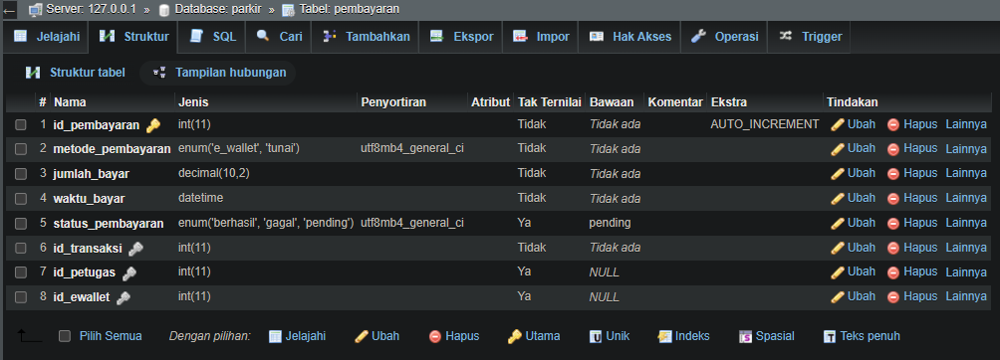
    </td>
  </tr>
  <tr>
    <td width="50%">
      <b>Struktur Tabel `struk_digital`</b><br/>
      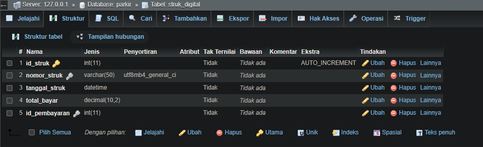
    </td>
    <td width="50%">
      <b>Struktur Tabel `qr_code_parkir`</b><br/>
      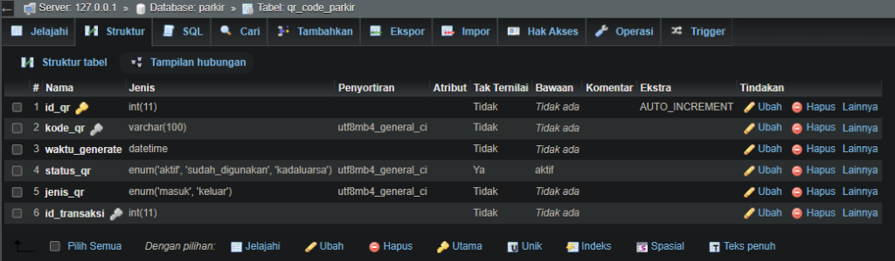
    </td>
  </tr>
  <tr>
    <td width="50%">
      <b>Struktur Tabel `laporan_parkir`</b><br/>
      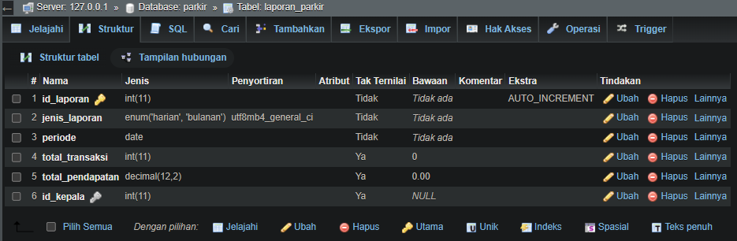
    </td>
    <td width="50%">
      <b>Struktur Tabel `cctv_loket_masuk`</b><br/>
      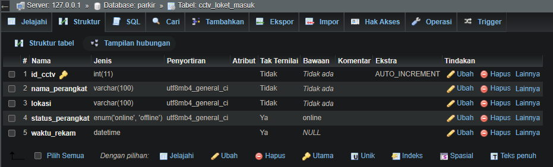
    </td>
  </tr>
</table>

### 3. Diagram Alur Proses Sistem (BPMN / System Flowchart)
Pemetaan langkah operasional sistem mulai dari kedatangan kendaraan, verifikasi parkir, pembayaran cashless, hingga penutupan transaksi:

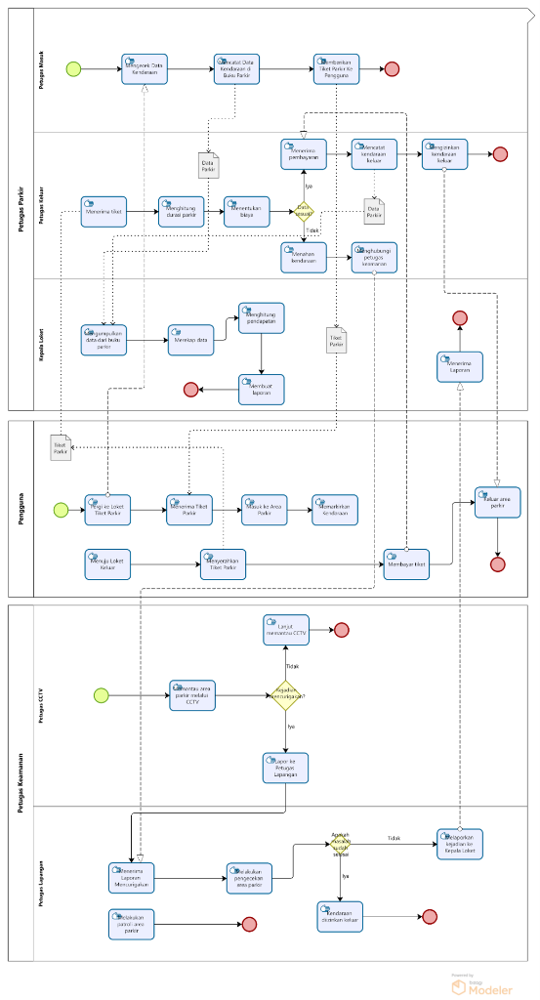

---

## 👤 Screenshot Peran (Role Showcase)

### 🚪 Halaman Masuk Aplikasi (Multi-Role Login)
Desain antarmuka login yang modern dan responsif menggunakan efek kaca mengkilap (*frosted glassmorphism*).
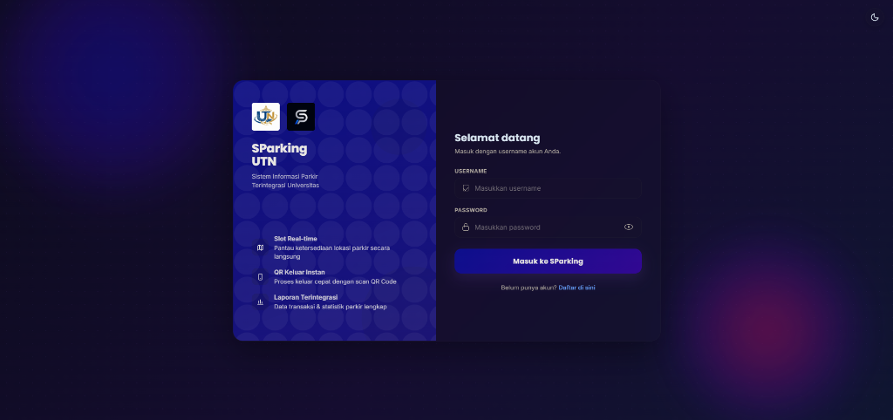

### 1. Portal Pengguna (Mahasiswa/Dosen/Staf)
Pengguna memiliki kontrol penuh terhadap kendaraan terdaftar, status e-wallet terintegrasi, dan struk digital mereka sendiri.
<table>
  <tr>
    <td width="50%">
      <b>Dashboard Pengguna</b><br/>
      Menampilkan saldo e-wallet terhubung, riwayat transaksi parkir, dan ringkasan statistik.
      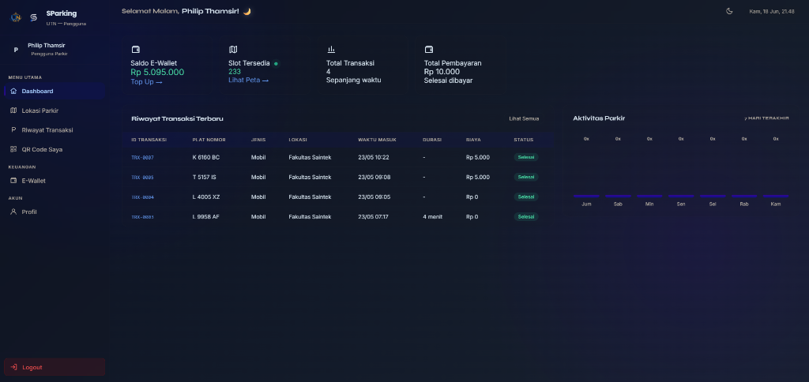
    </td>
    <td width="50%">
      <b>Struk Digital Pembayaran</b><br/>
      Kuitansi pembayaran digital yang rapi dan memuat rincian tarif secara transparan.
      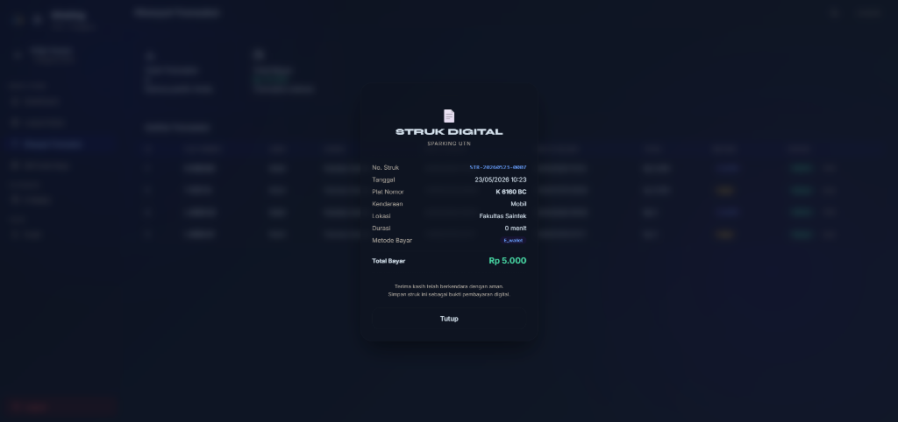
    </td>
  </tr>
  <tr>
    <td width="50%">
      <b>Pemesanan & QR Code Masuk</b><br/>
      Menghasilkan QR Code parkir otomatis yang siap di-scan petugas pintu masuk.
      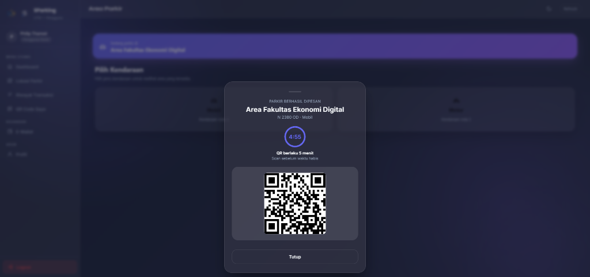
    </td>
    <td width="50%">
      <b>QR Code Check-Out Gerbang</b><br/>
      Kode QR yang ditampilkan di ponsel saat pengguna hendak meninggalkan area parkir.
      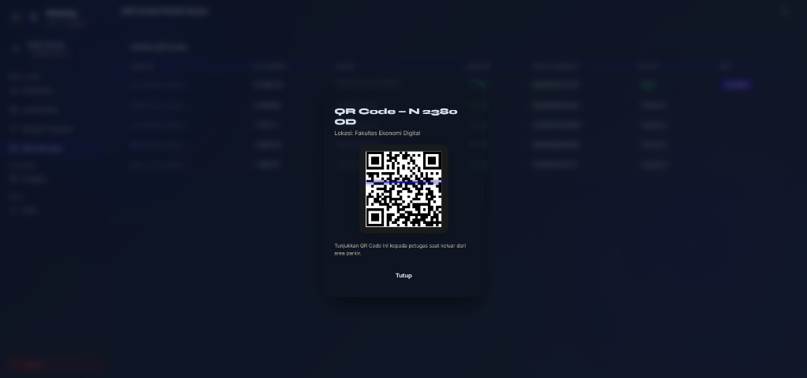
    </td>
  </tr>
</table>

### 2. Portal Petugas Gerbang Keluar
Petugas menggunakan scanner webcam laptop atau input manual kode transaksi untuk memotong saldo e-wallet pengguna.
<table>
  <tr>
    <td width="50%">
      <b>Dashboard Petugas</b><br/>
      Melihat statistik kendaraan aktif di dalam area parkir dan tombol pintasan operasional.
      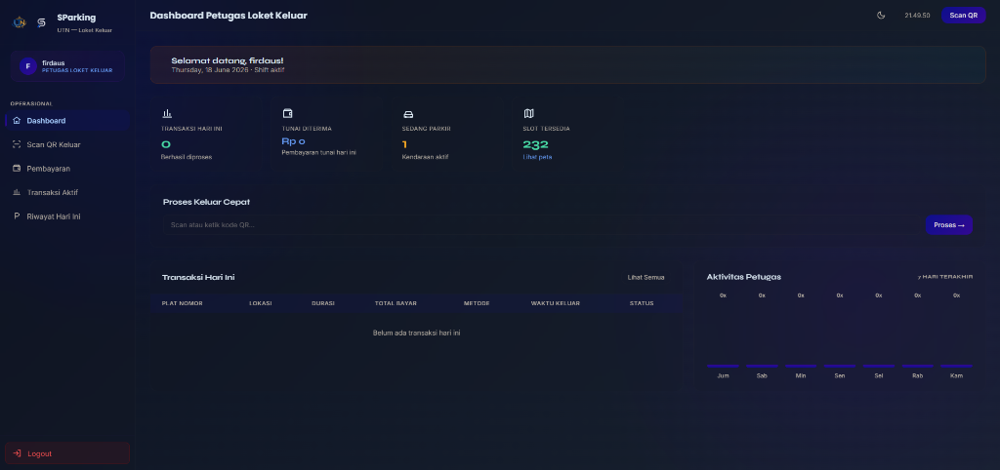
    </td>
    <td width="50%">
      <b>Kamera Webcam Scanner QR</b><br/>
      Pustaka scanner webcam real-time untuk memindai QR Code tiket parkir pengguna.
      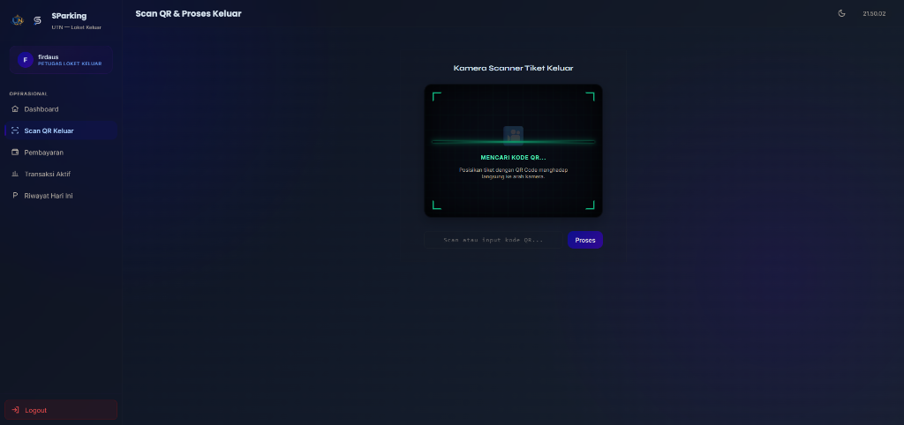
    </td>
  </tr>
  <tr>
    <td colspan="2" align="center">
      <b>Konfirmasi Pembayaran</b><br/>
      Kalkulasi biaya otomatis berdasarkan durasi aktif dan pilihan pemotongan saldo dari e-wallet terhubung.
      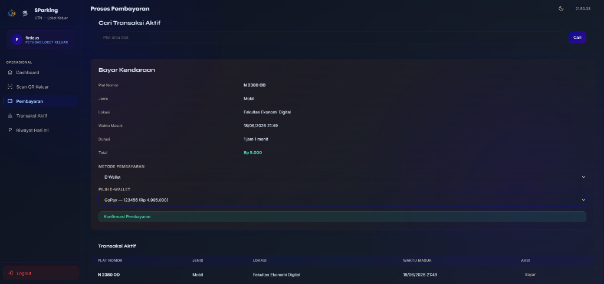
    </td>
  </tr>
</table>

### 3. Portal Kepala Loket (Administrator & Manager)
Manajer memiliki hak akses penuh untuk mengawasi kapasitas parkir, menyesuaikan tarif dasar, dan mengekspor laporan bisnis formal.
<table>
  <tr>
    <td width="50%">
      <b>Dashboard Kepala Loket</b><br/>
      Menampilkan metrik pendapatan harian, diagram aktivitas, dan pintasan administrasi.
      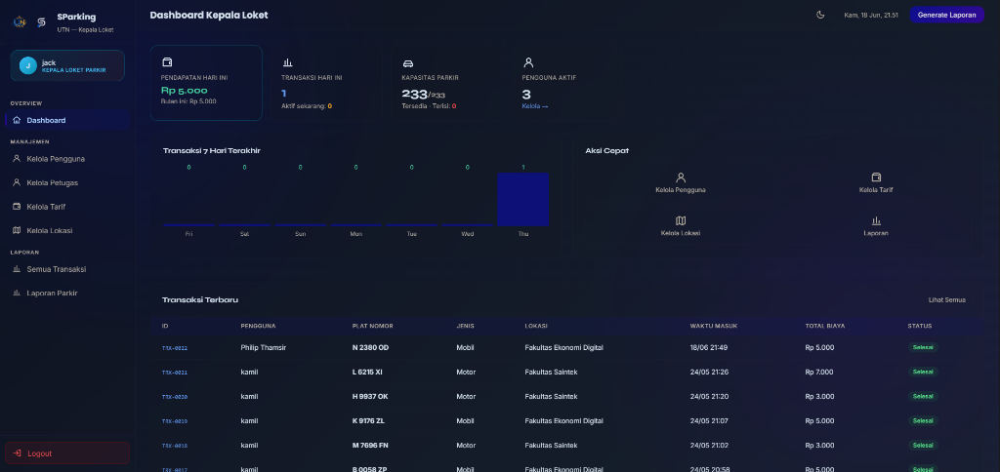
    </td>
    <td width="50%">
      <b>Pusat Pembuatan Laporan</b><br/>
      Filter laporan harian/bulanan dengan detail kueri tabel yang rapi sebelum dicetak.
      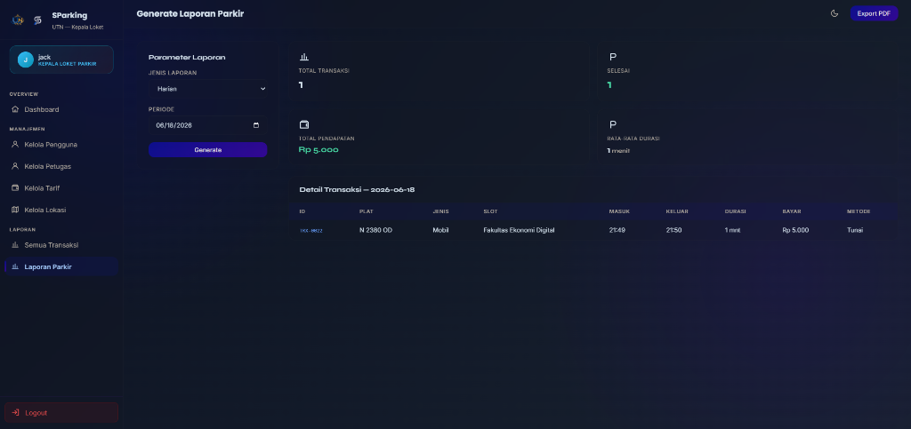
    </td>
  </tr>
  <tr>
    <td width="50%">
      <b>Pratinjau PDF Laporan</b><br/>
      Tampilan pratinjau dokumen laporan data parkir harian secara visual di dashboard.
      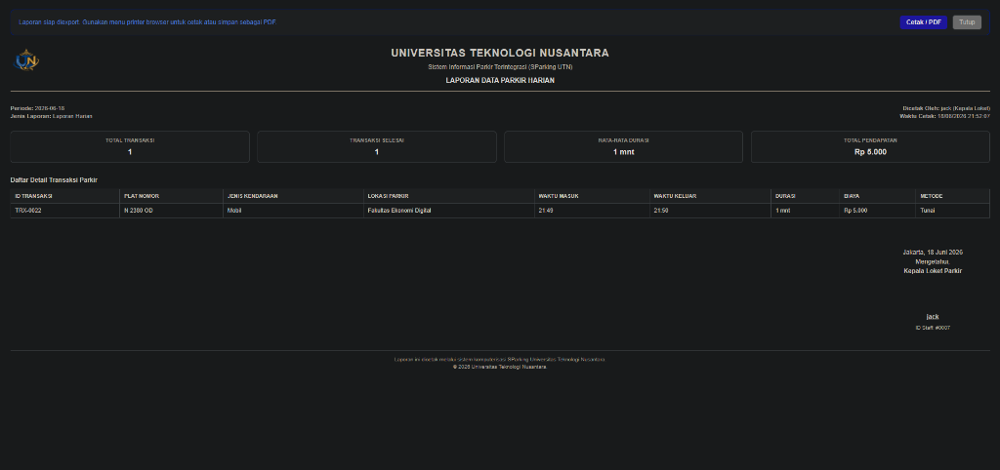
    </td>
    <td width="50%">
      <b>Ekspor PDF & Cetak</b><br/>
      Format cetak laporan formal yang siap disimpan ke dokumen fisik maupun digital.
      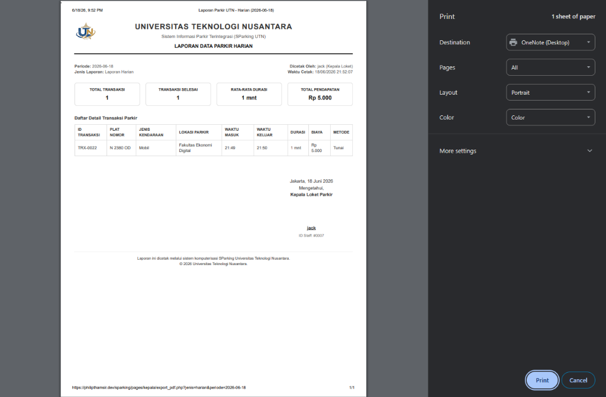
    </td>
  </tr>
</table>

---

## 🛠️ Pemetaan Teknologi (Tech Stack)

Sistem dibangun menggunakan tumpukan teknologi modern berikut:
*   **Bahasa Pemrograman**: Native PHP 7.4+ (menggunakan ekstensi `mysqli` dan Object-Oriented style).
*   **Basis Data**: MySQL / MariaDB.
*   **UI/UX**: HTML5, Vanilla CSS3 (Custom Design System dengan Glassmorphism, efek glow, animasi mengambang, serta font Google Fonts *Inter* & *Poppins*). Mendukung mode gelap (*Dark Mode*) bawaan yang sangat premium.
*   **API Pihak Ketiga**:
    *   **QR Server API**: Pembuatan QR Code otomatis.
    *   **Html5-Qrcode**: Pustaka Javascript untuk scanner kamera pada portal petugas.

---

## 🚀 Petunjuk Pemasangan (Setup Guide)

Ikuti langkah-langkah di bawah ini untuk menjalankan SParking UTN di komputer lokal Anda:

### 1. Prasyarat Sistem
*   Instal aplikasi **XAMPP** atau web server lokal sejenis yang mendapat dukungan **PHP 7.4+** dan **MySQL/MariaDB**.

### 2. Pemasangan Berkas
1.  Unduh atau salin seluruh folder proyek ini ke direktori root web server Anda (biasanya `C:\xampp\htdocs\parkir`).

### 3. Konfigurasi Database
Aplikasi memiliki fitur pembuat database otomatis yang sangat praktis:
1.  Jalankan modul **Apache** dan **MySQL** pada panel kontrol XAMPP Anda.
2.  Buka browser dan akses URL: `http://localhost/parkir/setup_db.php`.
3.  Halaman instalasi akan mendeteksi apakah database telah dibuat. Jika belum, sistem akan mengimpor file `parkir.sql` secara otomatis ke database MySQL Anda.
4.  Jika instalasi sukses, Anda akan melihat tombol **Masuk Ke Aplikasi** untuk dialihkan ke halaman masuk.

> [!NOTE]  
> Jika Anda ingin melakukan konfigurasi database secara manual, silakan edit berkas konfigurasi di `includes/config.php` pada bagian berikut:
> ```php
> if ($is_local) {
>     define('DB_HOST', 'localhost');
>     define('DB_USER', 'root');
>     define('DB_PASS', '');
>     define('DB_NAME', 'parkir');
> }
> ```

---

## 🔑 Kredensial Akun Uji Coba

Gunakan kredensial berikut untuk menguji coba fitur masing-masing role:

1.  **Pengguna (User)**:
    *   Username: `philip` atau `kamil`
    *   Password: *(Dapat melakukan registrasi akun baru langsung di halaman login)*
2.  **Petugas Gerbang (Staff)**:
    *   Username: `admin` atau `uus`
3.  **Kepala Loket (Manager)**:
    *   Username: `jack`

*(Catatan: Untuk masuk menggunakan akun demo di atas, silakan cek hash password pada tabel `akun_pengguna` di database atau tambahkan akun baru melalui menu pengelolaan Kepala Loket).*

---

*Dikembangkan untuk memberikan solusi parkir modern yang terintegrasi, estetik, dan efisien.*  
**SParking UTN — Smart & Integrated Parking System**
